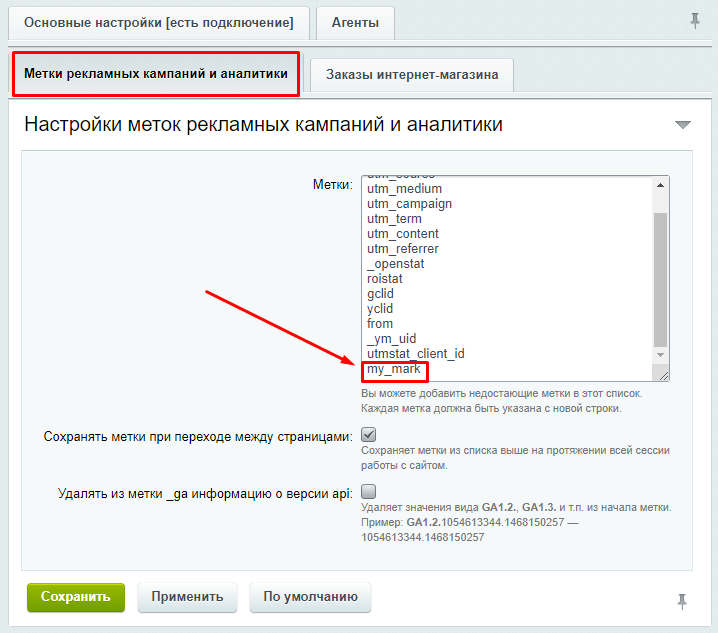
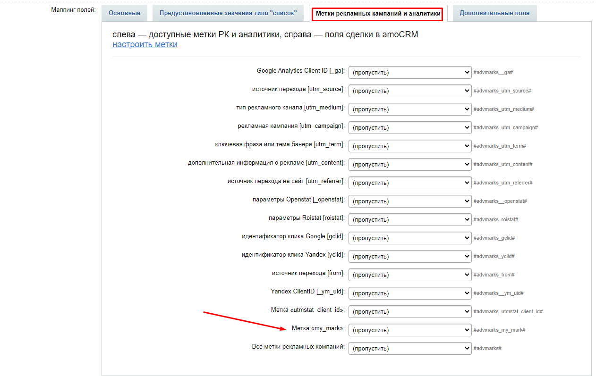

# Добавление меток рекалмных кампаний
Решение позволяет настроить добавление к сделкам, контактам и компаниями произвольных меток. Чаще всего это метки рекламных кампаний и аналитики, но также это могут быть любые другие метки. Главное условие — они должны содержаться в строке запроса, сессии или кукис.

На вкладке "Метки рекламных кампаний и аналитики" уже есть список предустановленных меток. Вы можете добавить сюда свои или удалить какие-нибудь из существующих. Каждая метка должна быть в отдельной строке.

Для примера добавим метку <b>my_mark</b>.

После того, как метка добавлена в настрйоках модуля, она появится на вкладке "Метки рекламных кампаний и аналитики" в настройках правила интеграции для сделок, контактов и кампаний, и с ней можно работать также, как и с остальными полями.

> Метки последовательно ищутся по своему коду в строке запроса (`$_REQUEST`), сессии (`$_SESSION`) и кукис (`$_COOKIE`). Если их там обнаружить не удастся, то они переданы не будут.
---
[на главную](./README.MD) 