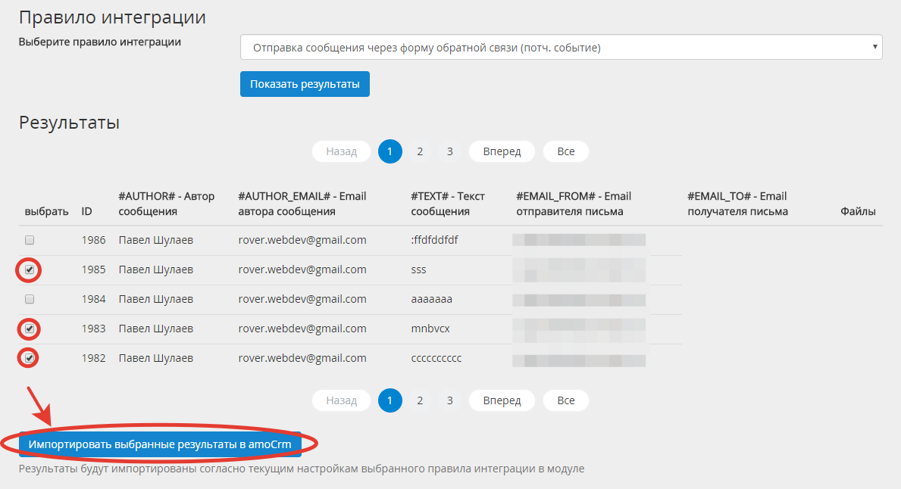

# Компоненты
## Импорт данных в AmoCrm (rover:amocrm.import)
Компонент позволяет импортировать в amoCrm сохраненные результаты заполненния веб-форм и значения почтовых событий.
 
В визуальном редакторе находится по адресу `Компоненты Rover->AmoCRM - интеграция с веб-формами и почтовыми событиями->Импорт данных в amoCrm`.

### Описание
Для возможности импорта в amoCrm результов веб-формы или почтового события, необходимо, чтобы в административной части создано соответствующее правило интеграции.
 
Первым шагом надо выбрать необходимое правило интеграции и нажать на кнопку «Показать результаты».
 

 
После этого будут показаны созраненные результаты для выбранного правила интеграции. Если результатов будет много, то они будут показаны на разных страницах и будет отображен пагинатор.

Чтобы импортировать нужные результаты, их надо отметить галочкой, а затем нажать на кнопку «Показать результаты».

Результаты перенесены!

<i>Примечание</i>: поля "рекламные метки" и "домен сайта" будут заполнены согласно текущим значениям сайта.

### Параметры
* `PER_PAGE` - Количество элментов, выводимых на одну страницу.

[на главную](./README.MD)
