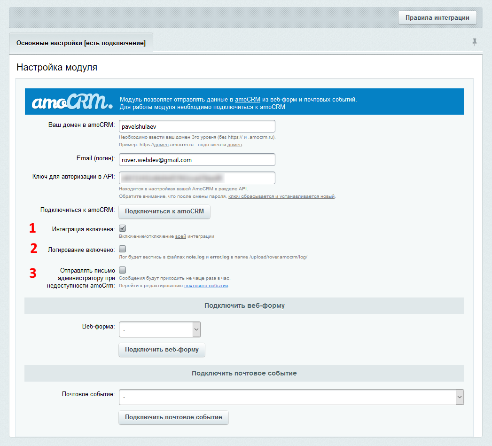

# Дополнительные настройки подключения

### 1. Интеграция включена
Все правила интеграции можно отключить, не нарушая подключение к amoCRM, для этого надо снять галочку «Интеграция включена» под кнопкой «Подключиться к amoCRM» и нажать «Сохранить»/«Применить».

###  2. Логирование включено
Эту галочку можно включить для логирования запросов к amoCRM и ответов от нее, а так же логирования ошибок.

###  3. Отправлять письмо администратору при недоступности amoCRM
Если эта опция включена и при связи с amoCRM возникла ошибки, то администратору будет направлено письмо об этом. Шаблон письма можно настроить, перейдя по ссылке. Письмо отсылается не чаще раза в час.

---
* [к оглавлению](../connection.md)
* [на главную](../README.MD)