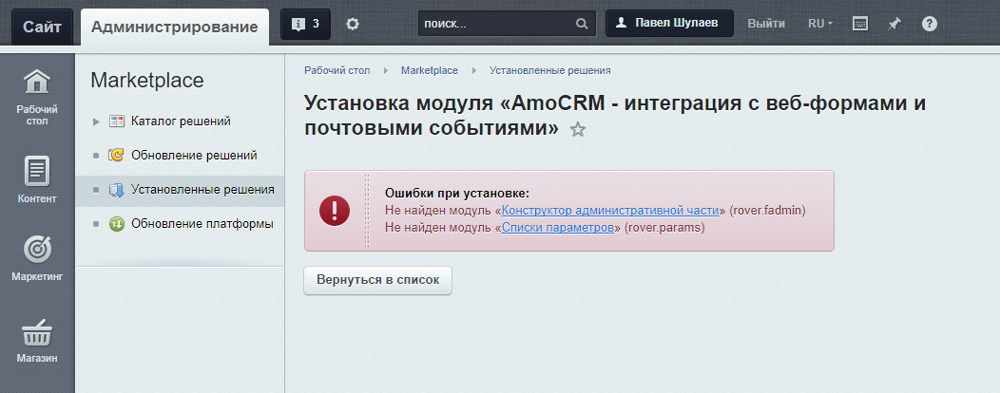
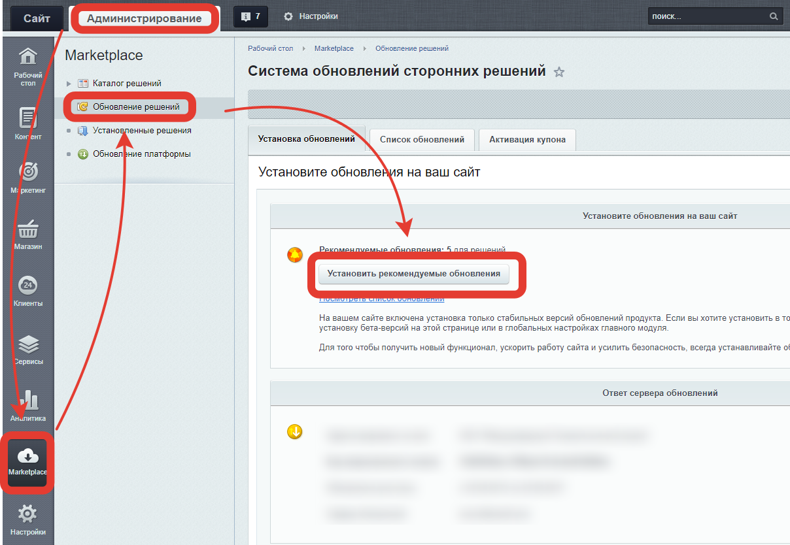
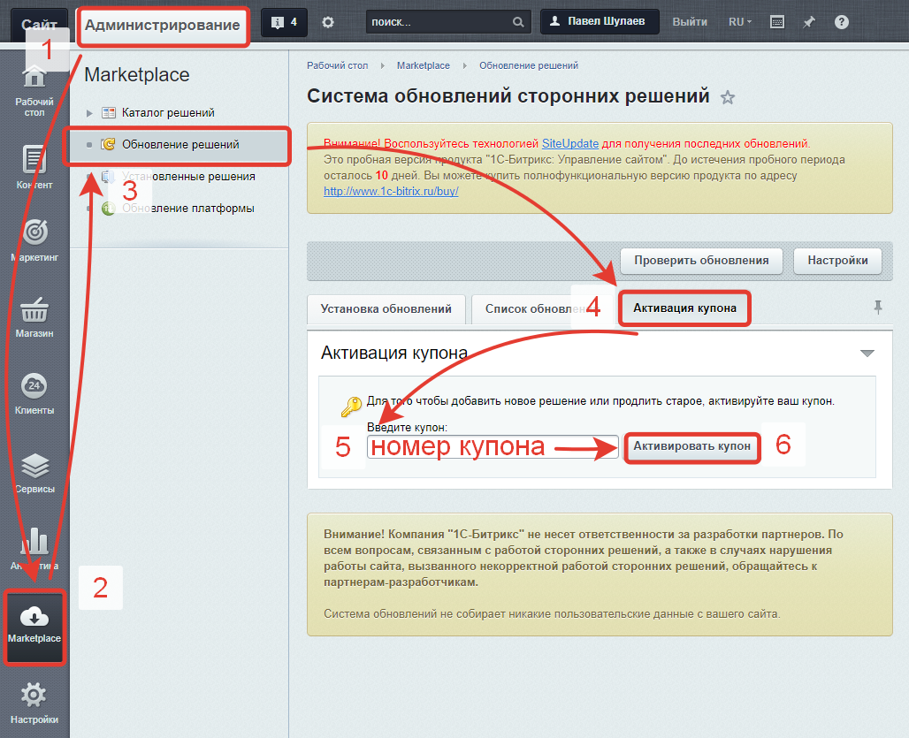

# Устновка «AmoCRM — интеграция с веб-формами и почтовыми событиями»
* [Установка из Marketplace](#Установка-из-marketplace)
    * [Установка вспомогательных решений](#Установка-вспомогательных-решений)
    * [бновление вспомогательных решений](#Обновление-вспомогательных-решений)
* [Переустановка со сбросом демо-периода](#Переустановка-со-сбросом-демо-периода)
* [Активация решения с помощью купона](#Активация-решения-с-помощью-купона)

## Установка из Marketplace
«Интеграция с амоСРМ» устанавливаетс стандартным образом. Перед установкой убедитесь, что на сайте установлены и обновлены до необходимых версий [«Конструктор административной части» (rover.fadmin)](https://github.com/pavelshulaev/fadmin) и [«Списки параметров» (rover.params)](https://github.com/pavelshulaev/params). Без них установка "Интеграции" невозможна.

### Установка вспомогательных решений
При попытке установить решение без установленных или обновленных до необходимых версий вспомогательных модулей, вы увидите такое сообщение:

Установить вспомогательные решения можно из «Маркетплейса»
* [«Конструктор административной части»](https://marketplace.1c-bitrix.ru/solutions/rover.fadmin/)
* [«Списки параметров»](https://marketplace.1c-bitrix.ru/solutions/rover.params/)

> Эти решения бесплатны и всегда таковыми останутся.

### Обновление вспомогательных решений
Если вспомогательные решения уже установлены, но их версии ниже необходимых, то их следует обновить. Для этого:
1. Зайти в административный раздел сайта
2. Перейти в раздел «Marketplace»
3. Перейти в подраздел «Обновление решений»
4. Открыть первую вкладку «Установка обновлений»
5. Нажать на кнопку «Установить рекомендуемые обновления»

После того как все вспомогателные решения установлены и/или обновалены до необходимых версий, можно устанавливать «AmoCRM — интеграция с веб-формами и почтовыми событиями» стандартным способом.

> Для установки и обновления решений необходимо, чтобы у вас на сайте была действующая лицензия. Если лицензия истекла, напишите на rover.webdev@gmail.com, или через форму на сайте https://www.rover-it.me и я вышлю вам дистрибутивы необходимых модулей.

## Переустановка со сбросом демо-периода
Если вы не успели протестировать все возможности модуля, а демо-период уже закончился, вы можете полностью переустановить модуль со сбросом всех настроек. Демо-период при этом так же будет сброшен. Для этого необходимо:
1. удалить модуль (деинсталлировать);
2. стереть модуль (удалить модуль полностью с сайта) - в списке модулей есть такая опция;
3. на странице выполнения SQL-запроса (Административный раздел - Настройки - Инструменты - SQL-запрос) написать: `DELETE FROM b_option WHERE MODULE_ID='rover.amocrm'` и нажать кнопку "Выполнить запрос";
4. повторно  установить модуль.

## Активация решения с помощью купона
После получения купона, для активации решения необходимо:
1) зайти в административный раздел сайта,
2) перейти в раздел «Marketplace»,
3) перейти в подраздел «Обновление решений»,
4) открыть вкладку «Активация купона»,
5) ввести номер купона в полке «Введите купон»,
6) нажать на кнопку «Активировать купона».

Если после активации купона решение не вышло из демо-режима, то необходимо:
1) На вкладке «Список обновлений» проверить, есть ли для решения обновления и если есть &mdash; обязательно установить их;
2) На вкладке «Установка обновлений» в блоке «Регистрация решений» нажать на кнопку «Зарегистрировать решения». 

Более подробную информацию можно найти в [курсе для хостеров 1С Битрикс](https://dev.1c-bitrix.ru/learning/course/?COURSE_ID=32&LESSON_ID=3182)

---
* [Справочный центр](../help.md)
* [на главную](../README.MD)