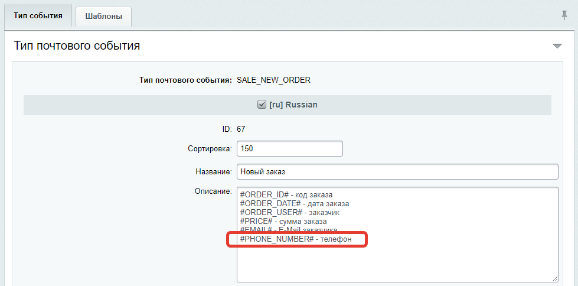

# Добавление полей почтовых событий
Бывают ситуации, когда существующих полей в почтовом событии недостаточно и требуется добавить новые. Например, в типе события "Новый заказ" (`SALE_NEW_ORDER`) очень нехватает поля "Телефон". Допустим, его добавили каким-либо способом и присвоили системный код `PHONE_NUMBER`. Возникает вопрос: <strong>как настроить интеграцию нового поля с amoCRM?</strong> Ответ: <strong>очень просто</strong>, для этого достаточно добавить его описание к описаниям других полей в настройках типа почтового события. 

Для примера рассмотрим добавление описания ранее добавленного поля "Телефон" (`PHONE_NUMBER`) для типа события "Новый заказ" (`SALE_NEW_ORDER`):
1. Находим описание типа события в административной части сайта (Настройки — Настройки продукта — Почтовые события — Типы почтовых событий — Новый заказ (SALE_NEW_ORDER));
2. В настройках типа события в поле "Описание" для каждого активного языка добавляем с новой строки `#PHONE_NUMBER# - Телефон`;

Всё! Теперь вы можете интегрировать это поле точно так же, как и все остальные.

> Будьте внимателны в написании системного кода поля. Поле с таким именем должно существовать в почтовом событии. В случае ошибки ничего передано не будет.

<strong>По поводу добавления новых полей в существующие почтовые события, а так же добавления новых почтовых события в ваши решения пишите на rover.webdev@gmail.com или через форму на сайте https://rover-it.me.</strong>

---
* [на главную](../README.MD)