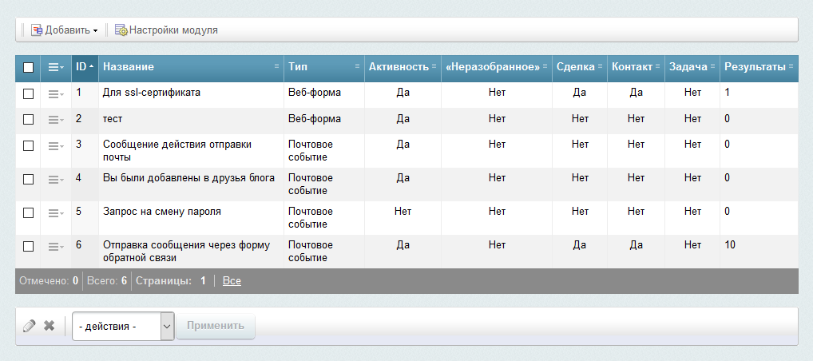

# Список правил интеграции с amoCRM
Список правил интеграции с amoCRM находится в административной части сайта по адресу «Сервисы» - «Интеграция с amoCRM».

Примерный вид списка правил интеграции 

Каждое правило интеграции позволяет осуществлять интеграцию одного почтового события или одной веб-формы с amoCRM.

## Возможности:
* [добавление нового правила интеграции](./rules/add.md)
* [настройки правила интеграции](./rules/update.md)
    * [настройка правила интеграции для почтового события "Новый заказ"](./rules/update/new-order.md)
* просмотр результатов для правила интеграции (раздел в разработке)
* импорт выбранных результатов в amoCRM (раздел в разработке)
---
* [Настройка подключения к amoCRM](./settings.md)
* [на главную](../README.MD)