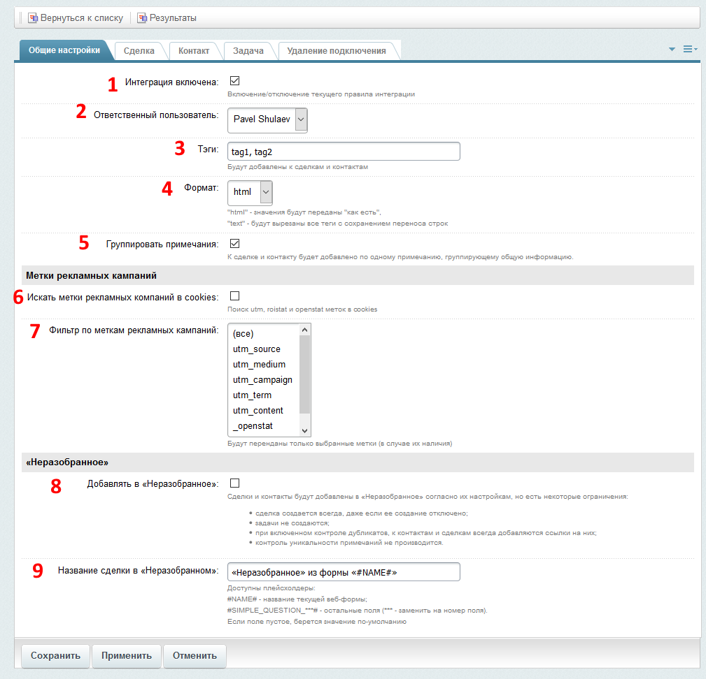

# Общие настройки

#### 1. Интеграция включена
Сняв эту галочку, можно полностью отключить работу правила интеграции

#### 2. Отвественный пользователь
Пользователь, назначемых отвественным за создаваемые сделку и/или контакт;

#### 3. Теги
Будут добавлены в поле "теги" к создаваемым сделке и/или контакту

#### 4. Формат
* html - информация передается "как есть", 
* text - информация будет очищена от тегов, переносы строк сохранены;

#### 5. Группировать примечания
Все примечания к сделке и/или контакту будут сгруппированы и добавлены в виде единственного примечения

#### 6. Искать метки рекламных кампаний в cookies
Метки рекламных кампаний будут искаться не только в заголвке сервера HTTP_REFERRER, но и в cookies

#### 7. Фильтр по меткам рекламных кампаний
Можно выбрать, какие именно метки передавать. Метки будут переданы в случае их наличия.

#### 8. Добавлять в «Неразобранное»
Сделка и контакт будут добавлены в виде «неразобранного» согласно их настройкам. Есть некоторые ограничения:
* сделка создается всегда, даже если ее создание отключено;
* задачи не создаются;
* при включенном контроле дубликатов, к контактам и сделкам всегда добавляются ссылки на них;
* контроль уникальности примечаний не производится.

#### 9. Название сделки в «Неразобранном»
Можно задать название сделки, создаваемой в «Неразобранном». Возможно использование плейсхолдеров.

---
* [Настройки правила интеграции](../update.md)
* [Список правил интеграции](../../rules.md)
* [На главную](../../README.MD)