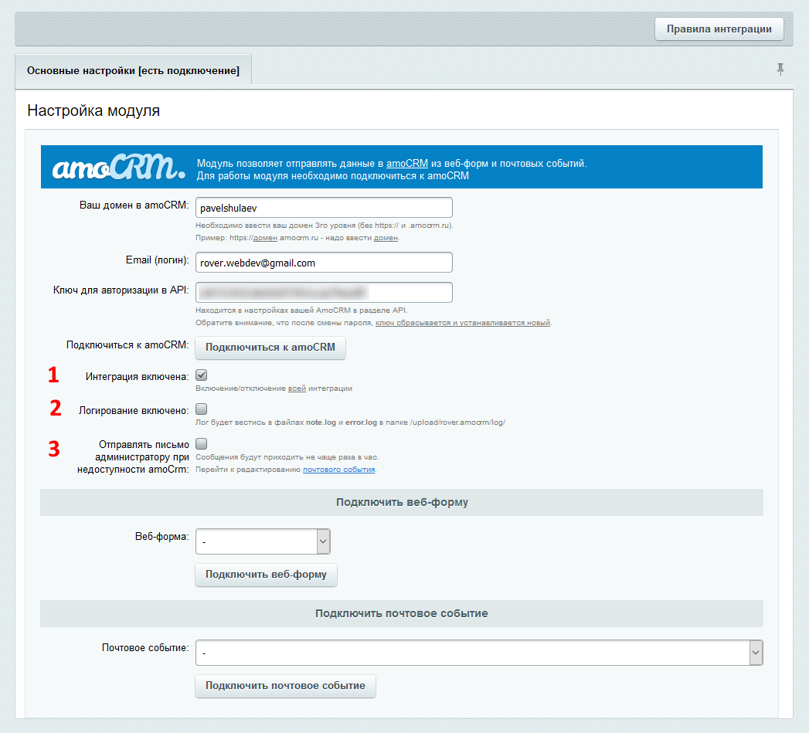

# Настройка подключения к amoCRM
Настройка подключения к amoCrm производится в административной части сайта по адресу «Настройки» - «Настройки модулей» - «AmoCRM — интеграция с веб-формами и почтовыми событиями». 

* [Основные настройки подключения](#Основные-настройки-подключения)
* [Дополнительные настройки подключения](#Дополнительные-настройки-подключения)

## Основные настройки подключения
Для настройки подключения на первой вкладке необходимо:

1. Ввести домен на проекте amoCRM;
2. Ввести email (логин);
3. Ввести ключ для авторизации в API (находится в настройках вашей amoCRM в разделе API. Обратите внимание, что после смены пароля, ключ сбрасывается и устанавливается новый).
4. Нажать на кнопку «Подключиться к amoCRM» либо «Сохранить»/«Применить».

Если введенные данные корректны, то статус в заголовке первой вкладки измениться с «нет подключения» на «есть подключение».

 
Если в процессе подключения возникли ошибки, то они будут отображены над вкладками.

После успешного подключения к amoCRM, модуль предоставит возможность создавать правила интеграции для почтовых событий и веб-форм (в старших редакциях Битрикса). 

Настроить новое правило интеграции можно прямо в настройках подключения на отдельной вкладке, но рекомендуется делать это в новом, специально предназначенном для этого интерфейсе. Перейти в него можно, нажав на кнопку "Правила интеграции" над формной настройки подключения.

В разделе «[Настройка правил интеграции](./rules.md)» рассмотрена настройка через новый интерфейс. Старый интерфейс со временем будет отключен.

> Обратите внимание, что если по каким-то причинам подключение к amoCRM установить не удалось, то все уже существующие правила интеграции отображены не будут.

## Дополнительные настройки подключения

### 1. Интеграция включена
Все правила интеграции можно отключить, не нарушая подключение к amoCRM, для этого надо снять галочку «Интеграция включена» под кнопкой «Подключиться к amoCRM» и нажать «Сохранить»/«Применить».

###  2. Логирование включено
Эту галочку можно включить для логирования запросов к amoCrm и ответов от нее, а так же логирования ошибок.

###  3. Отправлять письмо администратору при недоступности amoCrm
Если эта опция включена и при связи с amoCrm возникла ошибки, то администратору будет направлено письмо об этом. Шаблон письма можно настроить, перейдя по ссылке. Письмо отсылается не чаще раза в час.
---
* [Настройка правил интеграции](./rules.md)
* [Справочный центр](../help.md)
* [на главную](../README.MD)