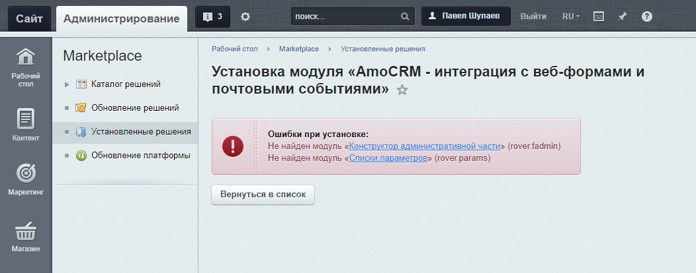
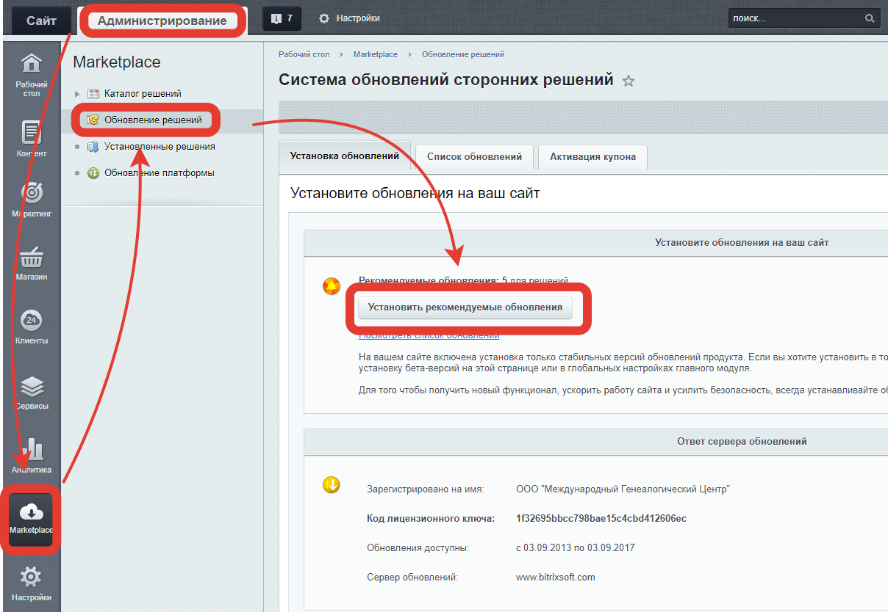

# Устновка «AmoCRM - интеграция с веб-формами и почтовыми событиями»
* [Установка из Marketplace](#Установка-из-Marketplace)
* [Установка вспомогательных решений](#Установка-вспомогательных-решений)
* [Активация решения с помощтю купона](#Активация-решения-с-помощтю-купона)

## Установка из Marketplace
После загрузки решения из «Маркетплейса», убедитесь, что на сайте установлены и обновлены до необходимых версий [«Конструктор административной части» (rover.fadmin)](https://github.com/pavelshulaev/fadmin) и [«Списки параметров» (rover.params)](https://github.com/pavelshulaev/params). Без них установка решения невозможна, а установщик amoCrm выдаст следующее предупреждение:

## Установка вспомогательных решений
Установить решения можно из «Маркетплейса»
* [«Конструктор административной части»](https://marketplace.1c-bitrix.ru/solutions/rover.fadmin/)
* [«Списки параметров»](https://marketplace.1c-bitrix.ru/solutions/rover.params/)

Эти решения бесплатны и всегда таковыми останутся.

Если решения уже установлены, но их версии ниже необходимых, то для их обновления необходимо:
1) Зайти в административный раздел сайта
2) Перейти в раздел «Marketplace»
3) Перейти в подраздел «Обновление решений»
4) Открыть первую вкладку «Установка обновлений»
5) Нажать на кнопку «Установить рекомендуемые обновления»

Для установки и обновления решений, у вас на сайте должна быть действующая лицензия. Если лицензия истекла, напишите на email rover.webdev@gmail.com, или через форму на сайте https://www.rover-it.me и я вышлю вам дистрибутивы необходимых модулей.

## Активация решения с помощтю купона
После получения купона, для активации решения необходимо:
1) Зайти в административный раздел сайта
2) Перейти в раздел «Marketplace»
3) Перейти в подраздел «Обновление решений»
4) Открыть вкладку «Активация купона»
5) Ввести номер купона в полке «Введите купон»
6) Нажать на кнопку «Активировать купона»

Если после активации купона решение не вышло из демо-режима, то необходимо 
1) На вкладке «Установка обновлений» проверить, есть ли для решения обновления и если есть - установить их
2) На этой же вкладке в блоке «Регистрация решений» нажать на кнопку «Зарегистрировать решения». 

Более подробную информацию можно найти в [курсе для хостеров 1С Битрикс](https://dev.1c-bitrix.ru/learning/course/?COURSE_ID=32&LESSON_ID=3182)

[на главную](./README.MD)