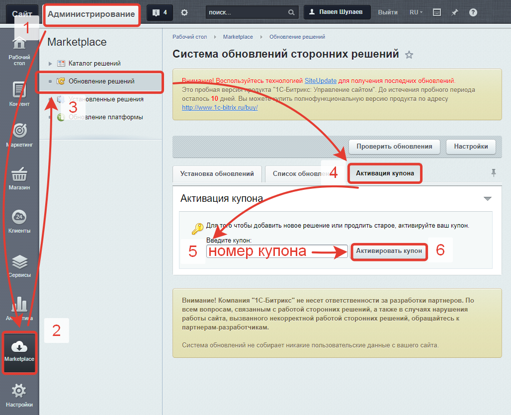

# Активация решения с помощью купона
После получения купона, для активации решения необходимо:
1) зайти в административный раздел сайта,
2) перейти в раздел «Marketplace»,
3) перейти в подраздел «Обновление решений»,
4) открыть вкладку «Активация купона»,
5) ввести номер купона в полке «Введите купон»,
6) нажать на кнопку «Активировать купон».

Если после активации купона решение не вышло из демо-режима, то необходимо:
1) На вкладке «Список обновлений» проверить, есть ли для решения обновления и если есть &mdash; обязательно установить их;
2) На вкладке «Установка обновлений» в блоке «Регистрация решений» нажать на кнопку «Зарегистрировать решения». 

Более подробную информацию можно найти в [курсе для хостеров 1С Битрикс](https://dev.1c-bitrix.ru/learning/course/?COURSE_ID=32&LESSON_ID=3182)

---
* [к оглавлению](../install.md)
* [на главную](../README.MD)