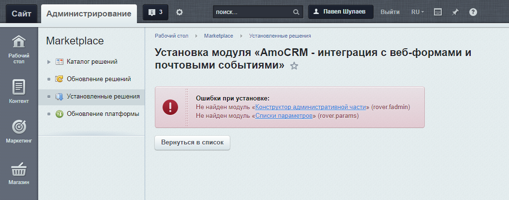

# Установка из Marketplace
«Интеграция с амоСРМ» устанавливается стандартным образом. Перед установкой убедитесь, что на вашем сайте 1С Bitrix установлены и обновлены до необходимых версий [«Конструктор административной части» (rover.fadmin)](https://github.com/pavelshulaev/fadmin) и [«Списки параметров» (rover.params)](https://github.com/pavelshulaev/params). Без них установка «Интеграции» невозможна.

## Установка вспомогательных решений
При попытке установить решение без установленных или обновленных до необходимых версий вспомогательных модулей, вы увидите такое сообщение:

Установить вспомогательные решения можно из «Маркетплейса»
* [«Конструктор административной части»](https://marketplace.1c-bitrix.ru/solutions/rover.fadmin/)
* [«Списки параметров»](https://marketplace.1c-bitrix.ru/solutions/rover.params/)

> Эти решения бесплатны и всегда таковыми останутся.

## Обновление вспомогательных решений
Если вспомогательные решения уже установлены, но их версии ниже необходимых, то их следует обновить. Для этого:
1. Зайти в административный раздел сайта
2. Перейти в раздел «Marketplace»
3. Перейти в подраздел «Обновление решений»
4. Открыть первую вкладку «Установка обновлений»
5. Нажать на кнопку «Установить рекомендуемые обновления»

После того как все вспомогателные решения установлены и/или обновлены до необходимых версий, можно устанавливать «AmoCRM — интеграция с веб-формами и почтовыми событиями» стандартным способом.

> Для установки и обновления решений необходимо, чтобы у вас на сайте была действующая лицензия. Если лицензия истекла, напишите на rover.webdev@gmail.com, или через форму на сайте https://www.rover-it.me и я вышлю вам дистрибутивы необходимых модулей.

---
* [к оглавлению](../install.md)
* [на главную](../README.MD)