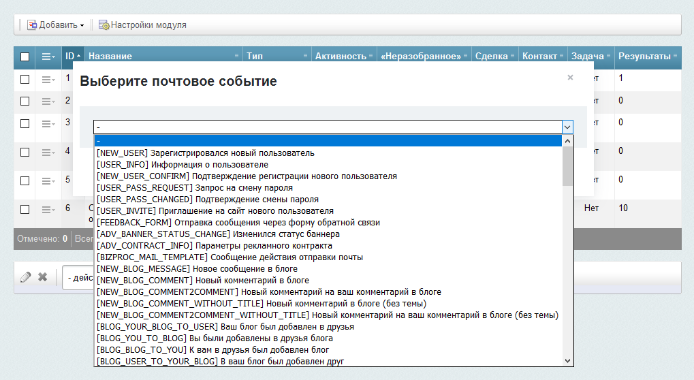
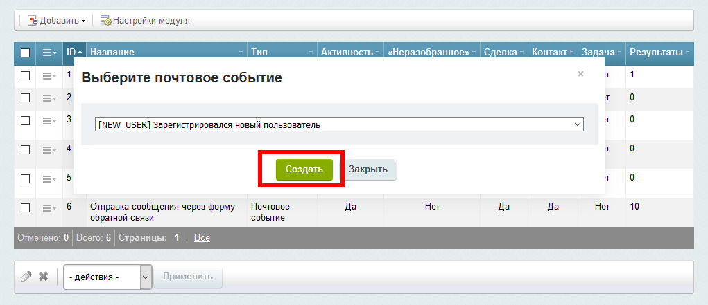

# Добавление нового правила интеграции

Для добавления нового правила интеграции, необходимо нажать на кнопку «Добавить» и в выпадающем списке выбрать тип добавляемого правила.

Затем необходимо выбрать тип почтового события или веб-форму

И нажать на кнопку «Создать»

После этого вы перейдёте в интерфейс настройки добавленного правила интеграции. Если правило уже суещствует, то вы так же перейдёте в интерфейс его настройки.

* [Настройки правила интеграции](./update.md)
* [Список правил интеграции](../rules.md)
* [На главную](../README.MD)