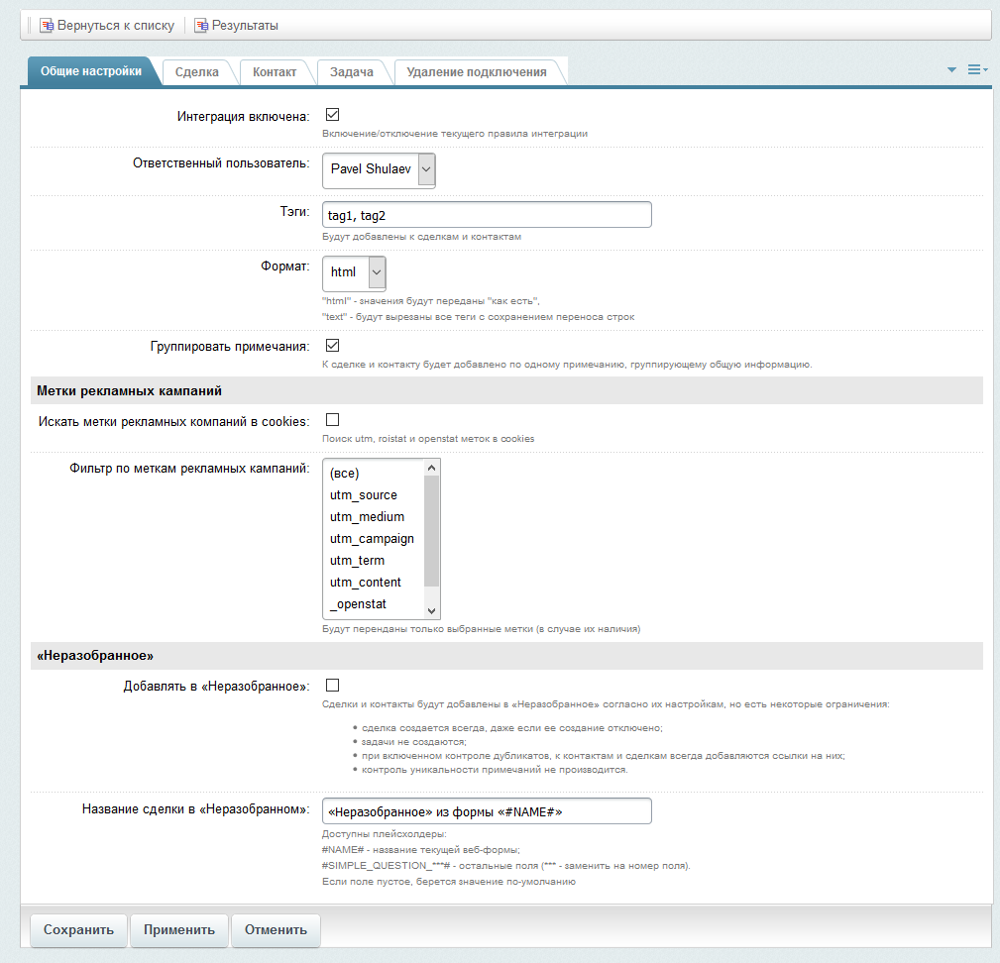

# Настройки правила интеграции

Примерный вид интерфейса

Интерфейс настройки правила интеграции позволяет:
* [Задать общие настройки](./update/common.md)
* [Настроить параметры создаваемой сделки](./update/lead.md)
* Настроить параметры создаваемого контакта
* Настроить параметры создаваемой задачи
* Удалить правило интеграции

