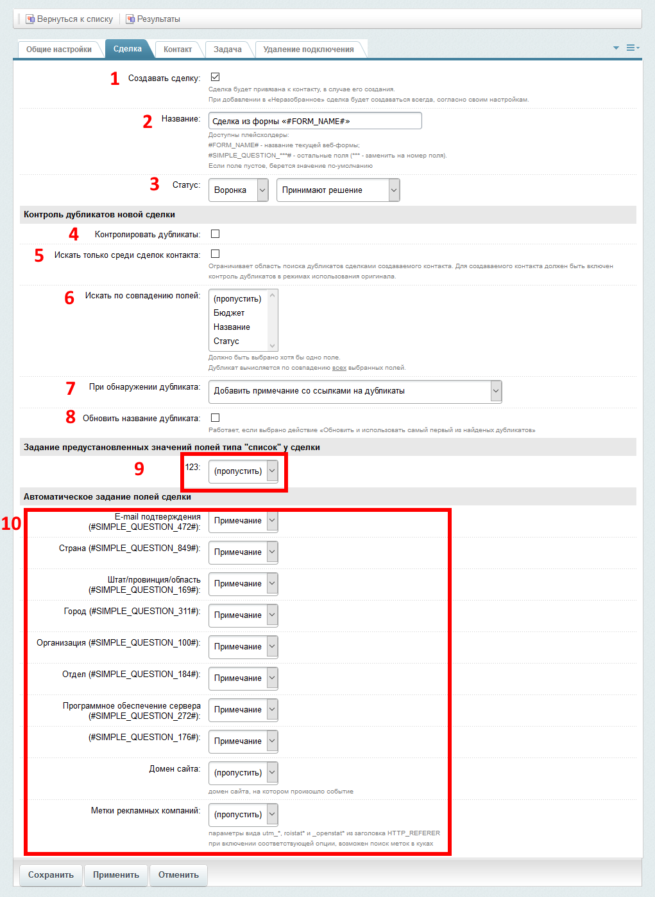

# Настройка параметров создаваемой сделки

Примерный вид интерфейса

#### 1. Создавать сделку
Сняв эту галочку, можно отключить создание сделки

#### 2. Название
Название создаваемой сделки. ожно использовать плейсхолдеры

#### 3. Статус
Статус создаваемой сделки. Если используется более одной воронки, то появляется возможноть выбрать и её.

#### 4. Контролировать дубликаты
Контроль дубликатов создаваемой сделки

#### 5. Искать только среди сделок контакта
Если опция включена, то контроль дубликатов будет производится только среди сделок контакта. Для создаваемого контакта должен быть включен контроль дубликатов в режимах использования оригинала.

#### 6. Искать по совпадению полей
Поля, по совпадению которых, будут вычисляться дубликаты. Если не выбрано ни одного поля, то дубликаты искаться не будут.

#### 7. При обнаружении дубликата
Действие при обнаружении дуликата

#### 8. Обновить название дубликата
Обновлять или нет название сделки при нахождении дуликата.

#### 9. Задание предустановленных значений полей типа "список" у сделки

#### 10.Автоматическое задание полей сделки

[Настройки правила интеграции](../update.md)

[Список правил интеграции](../../rules.md)

[На главную](../README.MD)