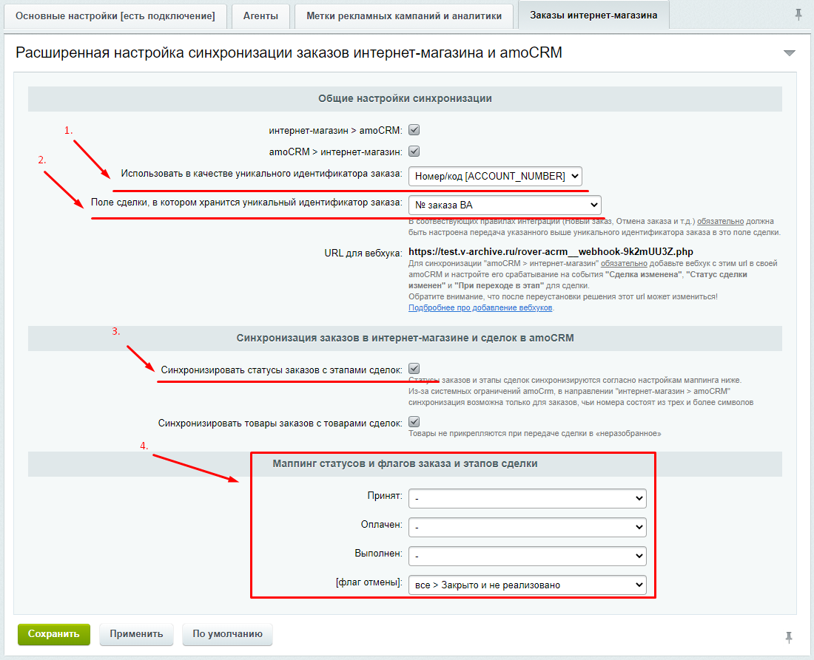
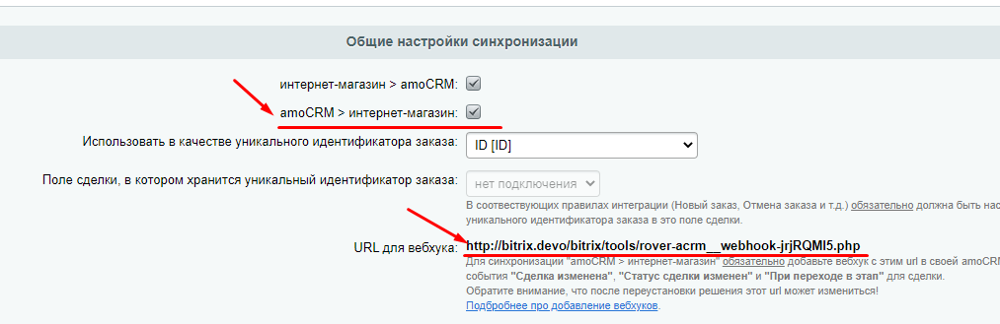

# Синхронизация статусов заказов в магазине и сделок в amoCRM [с версии 2.2]

Решение позволяет настроить двустороннюю синхронизацию статусов заказов в интернет-магазине и статусов сделок в амоЦРМ.

## Общие настройки

Для синхронизации статусов необходимо:
1. Выбрать поле заказа, которое будет использовано в качестве его уникального идентификатора
2. Указать кастомное поле сделки, в которое передаётся уникальный иденитификатор заказа.
3. Настроить маппинг статусов заказа и статусов сделки.

> Обратите внимание, настройки в пунктах 1. и 2. только указывают решению, в каком поле сделки искать уникальный идентификатор заказа. Передачу уникального идентификатора заказа в это поле сделки необходимо настроить отдельно в соотвествующем правиле интеграции (например, "Новый заказ", "Заказ оплачен" и т.д.).

## Настройка синхронзации статусов заказов интернет-магазина со статусами сделки в амоCRM
Для данной синхронизации необходимо:
1. Произвести все настройки из пункта ["Общие настройки"](#общие-настройки) 
2. Отметить галочку "интернет-магазин > amoCRM".

> Из-за системных ограничений со стороны amoCRM, данная синхронизация возможна только для тех заказов, чьи уникальные идентификтаоры содержат не менее трёх символов.

## Настройка синхронзации статусов сделки в амоCRM со статусами заказов в интернет-магазине
Для данной синхронизации необходимо:
1. Произвести все настройки из пункта ["Общие настройки"](#общие-настройки) 
2. Отметить галочку "amoCRM > интернет-магазин"
3. Добавить со стороны amoCRM вебхук на адрес, указанный в пункте "URL для вебхука" и настроить его срабатывание на событие "Статус сделки изменен" или "При переходе в этап" для сделки.

> [Подробнее про добавление вебхуков](https://www.amocrm.ru/developers/content/api/webhooks)
---
[на главную](./README.MD)    